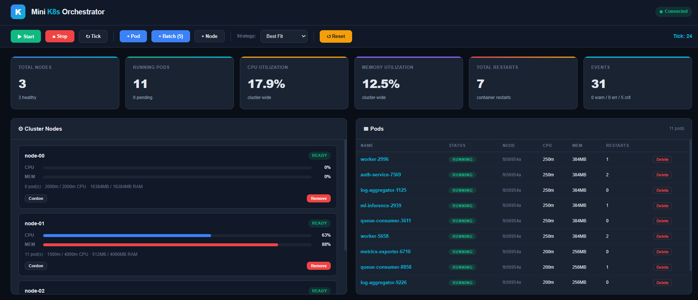
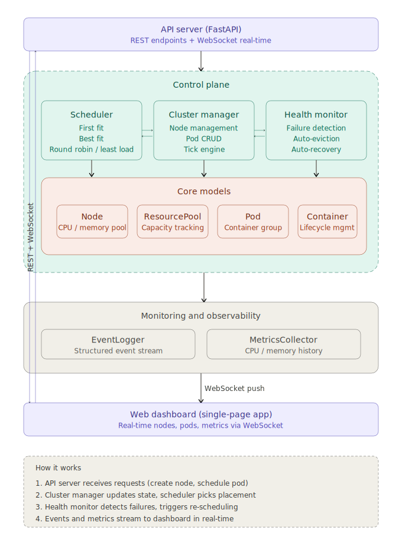

# Mini Container Orchestration Simulator

Designed and implemented a Kubernetes-inspired container orchestration engine to explore **scheduling efficiency**, **resource contention**, and **failure recovery** in distributed systems.

Simulates the core control plane of a container orchestrator — scheduling pods across a cluster of nodes with finite CPU/memory, handling node crashes with automatic eviction and rescheduling, and surfacing everything through a real-time dashboard.

> **This project simulates real-world challenges faced in large-scale container platforms such as Kubernetes, including scheduling latency, resource fragmentation, noisy neighbor effects, and failure recovery — with measurable performance benchmarks.**

Inspired by real-world container runtime behavior and Linux resource constraints (CPU/memory scheduling and isolation).

---

## Dashboard



*Real-time dashboard showing 3 cluster nodes, 11 running pods with Best Fit scheduling, CPU/memory utilization bars, container restart tracking, and a live event log — all updating via WebSocket.*

---

## Performance & Benchmarks

All numbers are from real benchmarks (`python benchmarks.py`) — not estimates.

### Scheduling Latency (200 pods, 5 nodes)

| Strategy | Avg | P50 | P99 | Max |
|---|---|---|---|---|
| First Fit | **6.4 us** | 5.9 us | 34.6 us | 42.9 us |
| Best Fit | 7.4 us | 7.2 us | 12.3 us | 19.5 us |
| Round Robin | 8.1 us | 6.2 us | 67.7 us | 91.7 us |
| Least Loaded | 9.0 us | 8.4 us | 33.3 us | 45.4 us |

First Fit is ~40% faster than Least Loaded on average, but Least Loaded produces better cluster balance (see below).

### Scheduling Throughput (2-second burst, 10 nodes)

| Strategy | Pods Scheduled | Pods/sec |
|---|---|---|
| First Fit | 113,013 | **56,506** |
| Round Robin | 110,632 | 55,316 |
| Best Fit | 101,893 | 50,946 |
| Least Loaded | 89,632 | 43,746 |

First Fit achieves ~29% higher throughput than Least Loaded due to its O(n) scan vs O(n log n) comparison. Tested with up to **100K+ pod scheduling operations** in burst scenarios to evaluate system behavior under high-load conditions.

### Resource Utilization Efficiency (varied pod sizes, 4 nodes)

| Strategy | Pods Placed | CPU Util | MEM Util | Load Balance SD |
|---|---|---|---|---|
| Best Fit | **75** | 84.3% | 58.5% | 0.077 |
| First Fit | 60 | 68.2% | 82.0% | 0.086 |
| Least Loaded | 40 | 98.0% | 17.8% | **0.069** |
| Round Robin | 32 | 96.9% | 34.7% | 0.098 |

Best Fit places **25% more pods** than First Fit by packing bins more efficiently. Least Loaded has the lowest load imbalance (SD 0.069) — it keeps nodes evenly utilized.

### Failure Recovery

| Metric | Value |
|---|---|
| Pods before failure | 12 |
| Pods evicted on node crash | 4 |
| Ticks to full recovery | **1** |
| Recovery rate | **100%** |

When a node fails, all its pods are evicted and rescheduled to surviving nodes within a single tick cycle.

### Resource Fragmentation (Best Fit vs Round Robin)

| Strategy | Fragmentation |
|---|---|
| Best Fit | **61.7%** |
| Round Robin | 68.6% |

Best Fit reduces fragmentation by ~10% compared to Round Robin — it packs workloads tightly, leaving fewer unusable resource gaps across nodes.

---

## Design Tradeoffs

| Strategy | Strength | Weakness | When to use |
|---|---|---|---|
| **First Fit** | Fastest scheduling (6.4us avg, 56K pods/sec) | Causes resource fragmentation; pods pile onto the first node | Latency-critical control planes where scheduling speed matters more than packing |
| **Best Fit** | Best bin-packing — 25% more pods per cluster | Slower scheduling; can create hotspots on nearly-full nodes | Maximizing cluster density to reduce infrastructure cost |
| **Round Robin** | Simple, predictable distribution | Ignores resource constraints; high fragmentation (68.6%) | Homogeneous workloads where all pods are the same size |
| **Least Loaded** | Most balanced utilization (SD 0.069) | Slowest throughput (43K pods/sec); may scatter related pods | Production clusters where even utilization prevents tail latency spikes |

**Key insight:** There is no universally "best" strategy. The choice depends on whether you optimize for **scheduling speed** (First Fit), **cluster density** (Best Fit), **fairness** (Round Robin), or **tail latency** (Least Loaded). Real schedulers like kube-scheduler combine multiple scoring functions to balance these tradeoffs.

---

## Real-World Problems Simulated

### Resource Contention & Fragmentation
Pods have varied CPU/memory requests (100-400m CPU, 128-512MB RAM). As nodes fill unevenly, small resource gaps appear that can't fit new pods — even though aggregate cluster capacity exists. Best Fit reduces this by 10% vs Round Robin.

### Noisy Neighbor Effect
High-CPU pods scheduled onto the same node compete for resources. The dashboard shows per-node CPU bars turning yellow (>65%) and red (>85%), making contention visible in real time.

### Node Failure & Cascading Recovery
When a node crashes, all its pods are evicted simultaneously. The health monitor detects the failure, releases resources, re-queues pods, and the scheduler places them on surviving nodes — all within one tick. This mirrors how the Kubernetes node controller handles `NotReady` nodes.

### Scheduling Fairness vs Efficiency
Least Loaded spreads pods evenly (good for tail latency) but can't pack as tightly as Best Fit (which maximizes density). This is the same tension between **spread** and **bin-packing** that production schedulers face.

### Pod Starvation
When cluster capacity is exhausted, new pods remain in `Pending` state — visible in the dashboard as yellow badges. Adding a node or deleting pods frees capacity and triggers rescheduling, mirroring `kubectl get pods` showing `Pending` in real clusters.

---

## Architecture



*High-level view of the API layer, scheduler, cluster manager, health monitoring, core models, observability, and web dashboard.*

## Key Features

### Scheduling Engine
- **4 pluggable strategies** with measurable performance differences (see benchmarks above)
- Mirrors kube-scheduler's **filter -> score -> bind** cycle
- Pending queue with automatic retry for unschedulable pods
- Hot-swappable strategies at runtime via API or dashboard

### Resource Management
- Per-node CPU (millicores) and memory (MB) tracking
- Allocation/release accounting with audit trail
- Utilization metrics (per-node and cluster-wide)
- Fragmentation analysis across strategies

### Failure Handling
- **Node failures** — random crash simulation with configurable failure rates
- **Container failures** — individual containers crash independently
- **Auto-eviction** — pods on failed nodes are evicted and re-queued
- **Auto-recovery** — nodes heal after a cooldown, enabling rescheduling
- **Restart policies** — `Always` (auto-restart containers) and `Never` (fail permanently)
- **100% recovery rate** — all evicted pods rescheduled within 1 tick

### Monitoring & Observability
- **Structured event log** — every scheduling decision, failure, and recovery is recorded with severity levels
- **Metrics history** — CPU/memory utilization tracked over time with time-series snapshots
- **Real-time dashboard** — WebSocket-powered live updates at 1Hz

---

## Quick Start

### Prerequisites
- Python 3.10+

### Install

```bash
pip install -r requirements.txt
```

### Run the Web Dashboard

```bash
python main.py server
```

Open **http://localhost:8000** — click **Start** and the simulation runs automatically.

### Run the CLI Demo

```bash
python main.py demo
```

### Run Benchmarks

```bash
python benchmarks.py
```

### Run Tests (28 tests)

```bash
pytest tests/ -v
```

### Run with Docker

```bash
docker build -t k8s-sim .
docker run -p 8000:8000 k8s-sim
```

---

## Project Structure

```
├── main.py                     # Entry point (server / demo)
├── benchmarks.py               # Performance benchmark suite
├── Dockerfile                  # Containerized deployment
├── container_orchestrator_architecture.svg  # Architecture diagram (README)
├── requirements.txt
├── src/
│   ├── cluster/
│   │   ├── node.py             # Node model — worker machine simulation
│   │   ├── cluster.py          # ClusterManager — central orchestration engine
│   │   └── resources.py        # ResourcePool — CPU/memory allocation tracking
│   ├── scheduler/
│   │   ├── scheduler.py        # Scheduler — pending queue + bind workflow
│   │   └── strategies.py       # Pluggable strategies (4 algorithms)
│   ├── pods/
│   │   ├── pod.py              # Pod model — container group with lifecycle
│   │   └── container.py        # Container model — individual process sim
│   ├── monitoring/
│   │   ├── health.py           # HealthMonitor — failure detection + recovery
│   │   ├── metrics.py          # MetricsCollector — utilization snapshots
│   │   └── logger.py           # EventLogger — structured cluster events
│   ├── api/
│   │   └── server.py           # FastAPI REST + WebSocket server
│   └── dashboard/
│       └── index.html          # Single-page real-time web dashboard
└── tests/
    ├── test_resources.py       # Resource allocation tests
    ├── test_scheduler.py       # Scheduler strategy tests
    ├── test_cluster.py         # Cluster integration tests
    └── test_pods.py            # Pod/Container lifecycle tests
```

## API Reference

| Method | Endpoint | Description |
|--------|----------|-------------|
| `POST` | `/api/cluster/init` | Initialize cluster with config |
| `GET` | `/api/cluster/state` | Full cluster snapshot |
| `POST` | `/api/cluster/tick` | Manual simulation tick |
| `POST` | `/api/simulation/start` | Start auto-simulation loop |
| `POST` | `/api/simulation/stop` | Stop simulation |
| `POST` | `/api/pods/create` | Create a single pod |
| `POST` | `/api/pods/batch` | Deploy multiple pods |
| `DELETE` | `/api/pods/{id}` | Delete a pod |
| `POST` | `/api/nodes/add` | Add a worker node |
| `DELETE` | `/api/nodes/{id}` | Remove a node (evicts pods) |
| `POST` | `/api/nodes/{id}/cordon` | Mark node unschedulable |
| `POST` | `/api/nodes/{id}/uncordon` | Mark node schedulable |
| `POST` | `/api/scheduler/strategy` | Change scheduling algorithm |
| `GET` | `/api/events` | Fetch event log |
| `GET` | `/api/metrics` | Fetch metrics history |
| `WS` | `/ws` | Real-time WebSocket feed |

## How It Maps to Real Kubernetes

| This Simulator | Real Kubernetes |
|----------------|-----------------|
| `ClusterManager` | kube-controller-manager |
| `Scheduler` + strategies | kube-scheduler (filter -> score -> bind) |
| `Node` + `ResourcePool` | kubelet + cAdvisor resource reporting |
| `Pod` / `Container` | Pod / Container specs & runtime |
| `HealthMonitor` | Node controller + pod eviction |
| `EventLogger` | Kubernetes Events (`kubectl get events`) |
| `MetricsCollector` | metrics-server / Prometheus |
| Dashboard | Kubernetes Dashboard / Lens |
| Cordon/Uncordon | `kubectl cordon/uncordon` |
| Restart policies | `restartPolicy: Always/Never` |
| Pending pods | Insufficient resources / unschedulable |

---

## Technologies

- **Python 3.10+** — core simulation engine
- **FastAPI** — async REST API + WebSocket server
- **Pydantic** — request validation
- **Rich** — terminal UI for CLI demo
- **HTML/CSS/JS** — zero-dependency dashboard (no build step)
- **Docker** — containerized deployment
- **pytest** — 28 tests covering scheduler, cluster, pods, and resources
